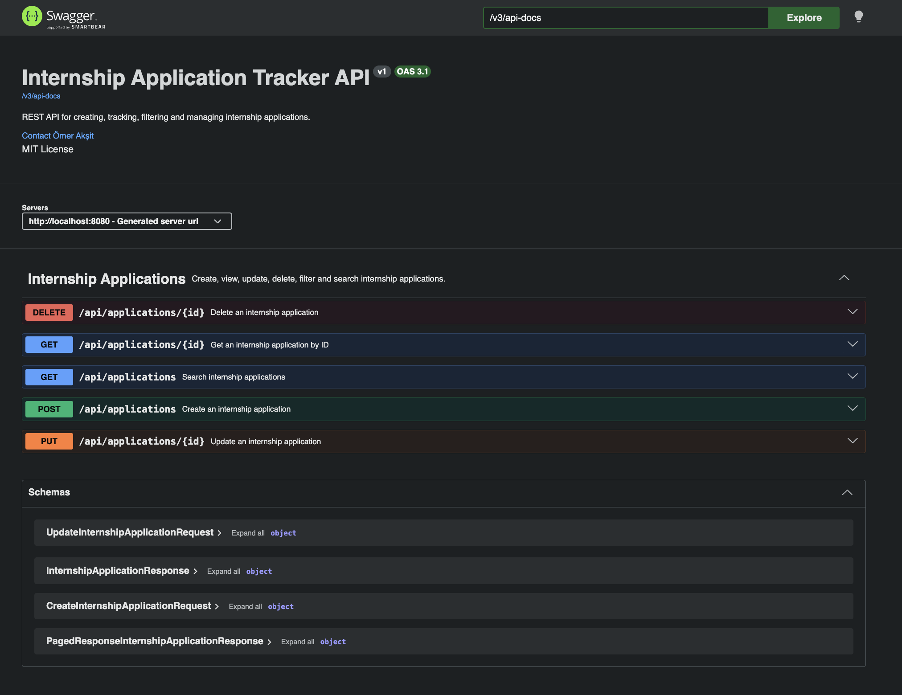
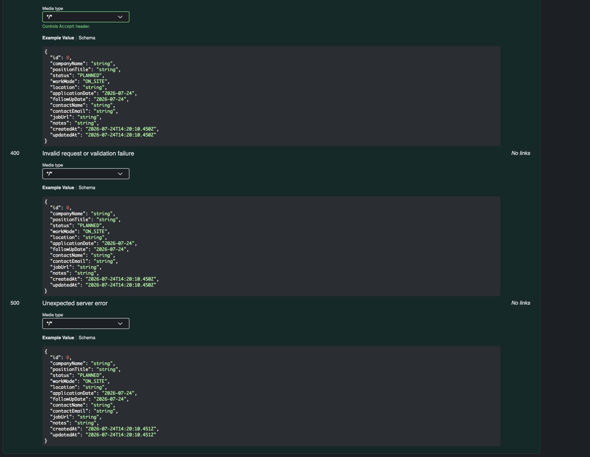
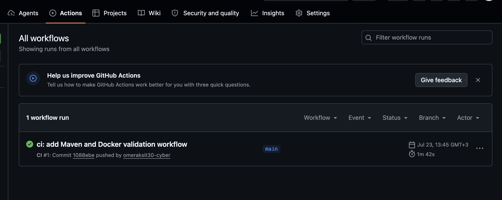
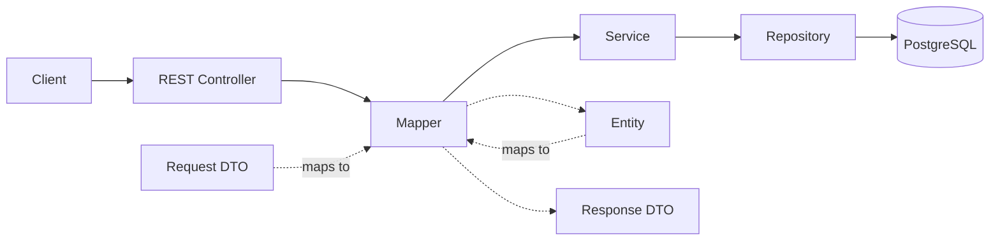

# Internship Application Tracker

A backend REST API for organizing and tracking internship applications,
interview stages, contacts and follow-up dates.

[](https://github.com/omeraksit30-cyber/internship-application-tracker/actions/workflows/ci.yml)


## Overview

Internship Application Tracker helps organize internship applications by
company, position, application status, work mode, contact information and
follow-up dates. The API supports filtering, case-insensitive text search,
pagination and allow-listed sorting so that application records remain easy to
query as the list grows.

This is a learning and portfolio project built to practice Java and Spring Boot
backend development, automated testing, PostgreSQL persistence, Docker-based
development and continuous integration. It is not currently deployed publicly.

## Screenshots

### Swagger API Overview



Interactive OpenAPI documentation for all application endpoints.

### Creating an Application



A successful POST request returning HTTP 201 and the created resource.

### Continuous Integration



GitHub Actions verifies the Maven test suite before validating the Docker image
build.

## Key Features

- Create, read, update and delete internship applications
- Bean Validation for request data
- Structured JSON error responses
- Status and work mode filtering
- Case-insensitive company and position search
- Zero-based pagination
- Allow-listed safe sorting
- Swagger UI and OpenAPI documentation
- PostgreSQL persistence at runtime
- H2-based automated tests
- Docker and Docker Compose development environment
- GitHub Actions continuous integration
- Secrets managed through environment variables

## Architecture



The controller handles HTTP requests, the mapper converts between API DTOs and
the JPA entity, the service applies application rules, and the repository
provides persistence through Spring Data JPA.

## Technology Stack

| Category | Technologies |
| --- | --- |
| Backend | Java 21, Spring Boot 4.1.0 |
| API | Spring Web MVC, Jakarta Validation, OpenAPI 3.1 |
| Persistence | Spring Data JPA, PostgreSQL |
| Testing | JUnit 5, Mockito, MockMvc, H2 |
| DevOps | Docker, Docker Compose, GitHub Actions |
| Build | Maven Wrapper |

## API Endpoints

| Method | Endpoint | Description |
| --- | --- | --- |
| `POST` | `/api/applications` | Create a validated internship application |
| `GET` | `/api/applications` | List applications with filtering, text search, pagination and safe sorting |
| `GET` | `/api/applications/{id}` | Retrieve one application by ID |
| `PUT` | `/api/applications/{id}` | Replace the editable fields of an existing application |
| `DELETE` | `/api/applications/{id}` | Delete an existing application |

## Quick Start

### Option 1 — Docker Compose

Docker Compose is the recommended way to run the application and PostgreSQL
together.

```bash
cp .env.example .env
```

Replace the example password in the local `.env` file with a strong password
before starting the services. Never commit `.env`.

```bash
docker compose up --build -d
docker compose ps
```

- API: http://localhost:8080/api/applications
- Swagger UI: http://localhost:8080/swagger-ui.html
- OpenAPI JSON: http://localhost:8080/v3/api-docs

Stop the containers while keeping the PostgreSQL volume:

```bash
docker compose down
```

To remove the containers and all local PostgreSQL data:

```bash
docker compose down -v
```

> Warning: `docker compose down -v` permanently deletes the local PostgreSQL
> named volume and every application record stored in it.

### Option 2 — Maven and Local PostgreSQL

Provide the runtime database settings through environment variables:

```bash
export DB_URL='jdbc:postgresql://localhost:5432/internship_tracker'
export DB_USERNAME='internship_user'
export DB_PASSWORD='<your-local-password>'
export JPA_DDL_AUTO='update'
./mvnw spring-boot:run
```

This option requires an accessible local PostgreSQL database. Maven itself does
not need to be installed separately because the repository includes Maven
Wrapper.

## Configuration

| Variable | Purpose | Example |
| --- | --- | --- |
| `DB_URL` | JDBC URL used by the Spring Boot application | `jdbc:postgresql://localhost:5432/internship_tracker` |
| `DB_USERNAME` | Runtime database username | `internship_user` |
| `DB_PASSWORD` | Runtime database password | `<your-local-password>` |
| `JPA_DDL_AUTO` | Hibernate schema management mode | `update` |
| `POSTGRES_DB` | Database created by the PostgreSQL container | `internship_tracker` |
| `POSTGRES_USER` | PostgreSQL container username | `internship_user` |
| `POSTGRES_PASSWORD` | PostgreSQL container password | `<your-local-password>` |
| `POSTGRES_PORT` | PostgreSQL port exposed on the host | `5432` |

`.env.example` is a tracked template containing safe placeholders. `.env` is
the local, ignored file used for real development values and must stay outside
version control.

## Running Tests

```bash
./mvnw clean verify
```

The test suite contains 102 tests and uses an H2 in-memory database, so Docker
and PostgreSQL are not required. The suite includes:

- Repository integration tests
- Service unit tests
- Mapper unit tests
- DTO validation tests
- MVC controller tests
- Exception handling tests
- OpenAPI documentation tests

## API Documentation

When the application is running, the generated documentation is available at:

- Swagger UI: http://localhost:8080/swagger-ui.html
- OpenAPI JSON: http://localhost:8080/v3/api-docs
- OpenAPI YAML: http://localhost:8080/v3/api-docs.yaml

## Example Requests

### Create an application

```bash
curl -i -X POST 'http://localhost:8080/api/applications' \
  -H 'Content-Type: application/json' \
  --data '{
    "companyName": "Example Tech",
    "positionTitle": "Backend Engineering Intern",
    "status": "APPLIED",
    "workMode": "REMOTE",
    "applicationDate": "2026-07-24",
    "contactEmail": "test@example.com"
  }'
```

Expected response: `201 Created`, a `Location` header and the created resource.

### Search and filter applications

```bash
curl -H 'Content-Type: application/json' \
  'http://localhost:8080/api/applications?status=APPLIED&workMode=REMOTE&search=Example&page=0&size=10&sortBy=createdAt&direction=desc'
```

The response is a paginated JSON object whose `content` array contains matching
applications.

### Structured validation error

```bash
curl -X POST 'http://localhost:8080/api/applications' \
  -H 'Content-Type: application/json' \
  --data '{"companyName":"","positionTitle":""}'
```

```json
{
  "timestamp": "2026-07-24T12:00:00Z",
  "status": 400,
  "error": "Bad Request",
  "message": "Validation failed",
  "path": "/api/applications",
  "fieldErrors": {
    "companyName": "Company name is required",
    "positionTitle": "Position title is required"
  }
}
```

[View complete API examples](docs/API_EXAMPLES.md)

## Testing Strategy

- **Unit tests:** verify service and mapper behavior in isolation.
- **Validation tests:** verify DTO constraints and validation messages.
- **Repository integration tests:** verify JPA persistence against H2.
- **MVC slice tests:** verify controller behavior and structured error
  responses.
- **Full context tests:** verify that the OpenAPI document is available.
- **CI:** runs Maven verification before the Docker image build.

## Project Structure

```text
src/main/java/com/omeraksit/internshiptracker/
├── config
├── controller
├── domain
├── dto
├── exception
├── mapper
├── repository
└── service

src/test/java/com/omeraksit/internshiptracker/
├── controller
├── documentation
├── domain
├── dto
├── exception
├── mapper
├── repository
└── service
```

Additional project files:

```text
.github/workflows/ci.yml
docs/
Dockerfile
compose.yaml
pom.xml
```

## Design Decisions

- DTOs keep API contracts separate from JPA entities.
- Constructor injection makes dependencies explicit and testable.
- A manual mapper was chosen for learning and transparent field conversion.
- Sorting fields are allow-listed before a `Sort` object is created.
- API errors use one structured response format.
- H2 is used for tests while PostgreSQL is used at runtime.
- Secrets stay outside version control and are supplied through environment
  variables.
- Docker uses a multi-stage build to separate compilation from runtime.
- CI runs Maven verification before Docker validation.

## Future Improvements

- Authentication and per-user application ownership
- Flyway database migrations
- Deployment to a public cloud platform
- Application metrics and health monitoring
- Optional frontend client
- Testcontainers-based PostgreSQL integration tests

These items are planned improvements and are not currently implemented.

## Author

**Ömer Akşit**

- GitHub: https://github.com/omeraksit30-cyber
- LinkedIn: https://linkedin.com/in/omer-aksit-a8b1791a2
- Email: omeraksit30@gmail.com

## License

This project is available under the [MIT License](LICENSE).
